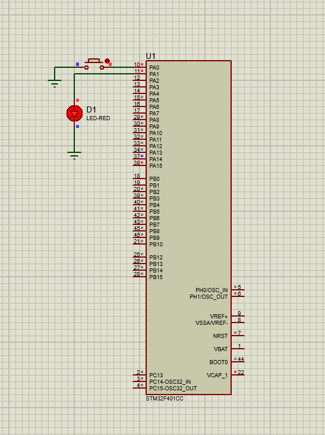

# lab7_emb

You are required to build a software to perform an LED toggle based on a button press.  
The Software shall detect a falling edge event on the button pin and then toggle the LED in an ISR. 

